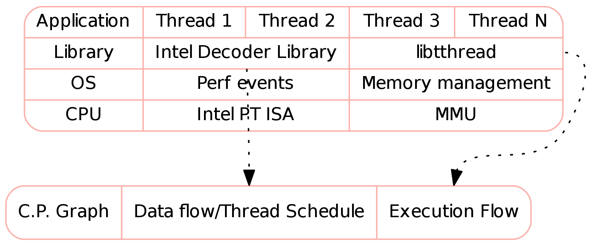
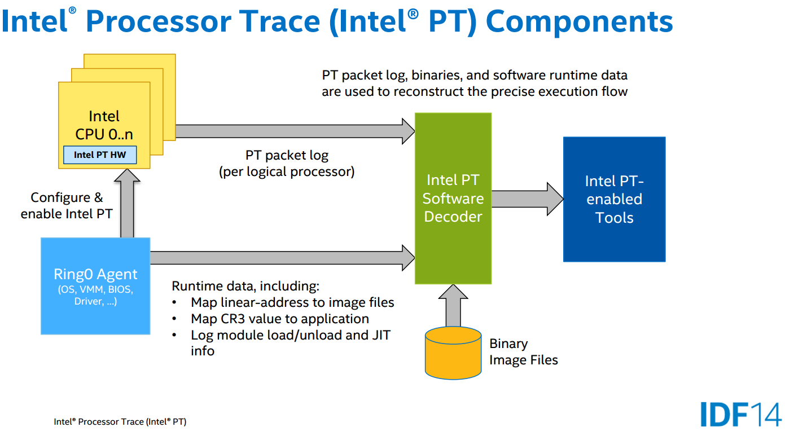
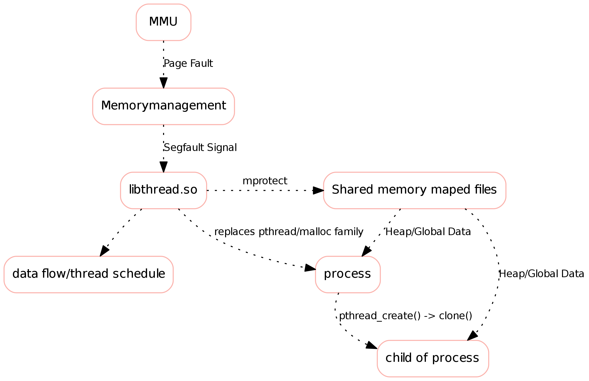

<!--
Multi-Monitor-Shortcuts:
Ctrl-O: Move Window to next screen
Mod4 + Control + j/k: Focus next/previous screen
reveal.js-Shortcuts:
o: Öffne Übersicht
s: Öffne Vortragsmonitor
-->

<!-- .slide: data-state="intro" -->
# Inspector

Jörg Thalheim

<joerg@higgsboson.tk>

Note:
- self-introduction

## Motivation

- in multithreaded, shared memory environments, its is still hard to do:
  - debugging
  - isolate compontents for security
  - taint tracing
  - DIFC (Dynamic information flow control)

Note:
- Even though tools getting better, most of the time we still depend debuggers
  like gdb to debug multithreaded programs, using coredumps and breakpoints
- However with gdb we only get result of computation, not how it got to this state
- In shared-memory systems it is also hard to keep track of which component or thread
  access which part of the memory and how threads where scheduled,
  which is needed for taint tracing or dynamic information flow control

## Solution

- Concurrent Provenance Graph:

  - data flow
  - thread schedule
  - control flow

Note:

- solution: build a Concurrent Provenance Graph
- data flow: get the read and write sets of all threads in order to see, how
  data was computed, what input lead to what crash
- thread schedule: split programm execution at synchronisation points like
  locks, barriers or thread exits and track in what order these parts get executed
- control flow: No which branch was taken and why.

## Design Goals

- transparent to application
- efficient

Note:
- run on unmodified executable,
- can be used as a replacement for the pthread library
- An application wrapper which configures the runtime linker to use our
  library in the application and traces the execution of the child
- low overhead, without rewriting the binary at runtime or execute the code in
  a virtual machine

## Architecture

Note:
- using Intel PT to gather the execution flow
- and a fork dthread infrastructure to log memory access using MMU

## Intel Processor Trace

- New ISA extensions
- Trace stream of control flow

→ Reconstruction of software execution path

Note:
- What is it:
  - New Instruction Extension of the Intel Broadwell Generation
- Features
  - Intel PT trace output includes control flow details, enabling precise reconstruction of the path of software execution
  - Also includes timing information, software context details, processor frequency indication, and more (not required here)
  - Provides not just function hierarchy, but why that path was taken
  - low overhead and less intrusive compared to
- How it works

Source: [Presentation Intel Pt](https://intel.activeevents.com/sf14/connect/fileDownload/session/64115DDAD8D7174736E4D82C5FA3A42C/SF14_ARCS001_100f.pdf)

## Tthread

Note:
- Context Menu -> View Image
- Application Wrapper setup execution environment, by setting LD\_PRELOAD, so
  libtthread.so will be loaded instead of pthread and the malloc family will
  be replaced
- Global Memory and Heap is located in a memory mapped file
- each thread will represented as a programm and has its own virtual memory
- writes to this memory will issue an Segmentation fault and record by
  libtthread
- changes to other processes are progragated at synchronisation points
  (locks/barriers/exits)

## Status
###Partially Done:

- first version of memory tracking library based on dthread (not stable for few
  benchmarks)

###TODO:

- Investigating on how to use Intel PT and decoder library
- Merge both logs to build graph

## Sources

- Project Page: [https://github.com/Mic92/tthread](https://github.com/Mic92/tthread)
- Intel Pt Perf event driver: [http://lxr.free-electrons.com/source/arch/x86/kernel/cpu/perf_event_intel_pt.c#L127](http://lxr.free-electrons.com/source/arch/x86/kernel/cpu/perf_event_intel_pt.c#L127)
- Intel Decoder library: [https://github.com/01org/processor-trace](https://github.com/01org/processor-trace)
